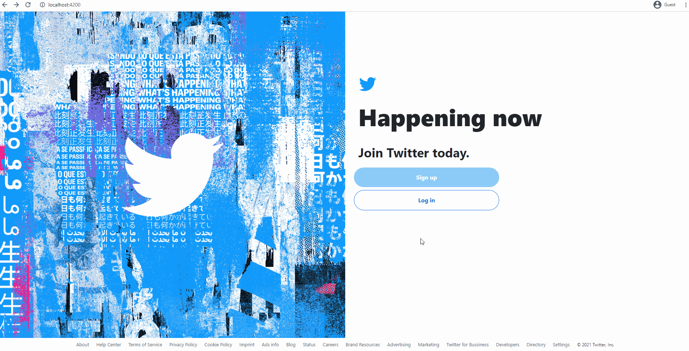
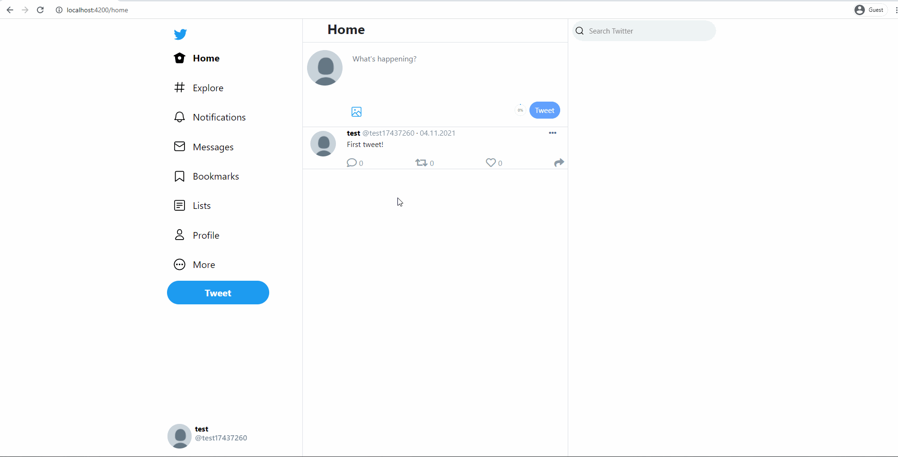
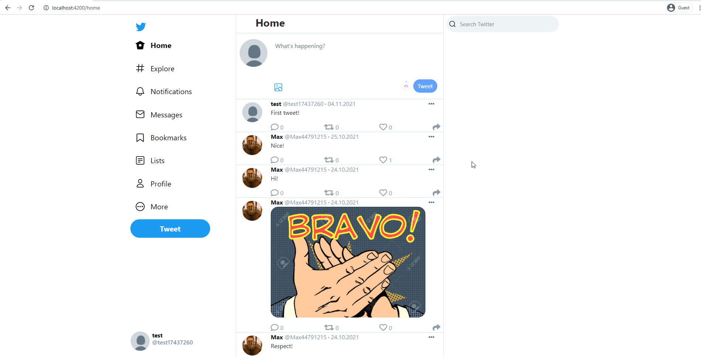
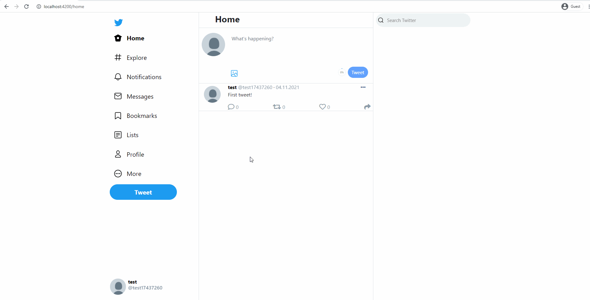
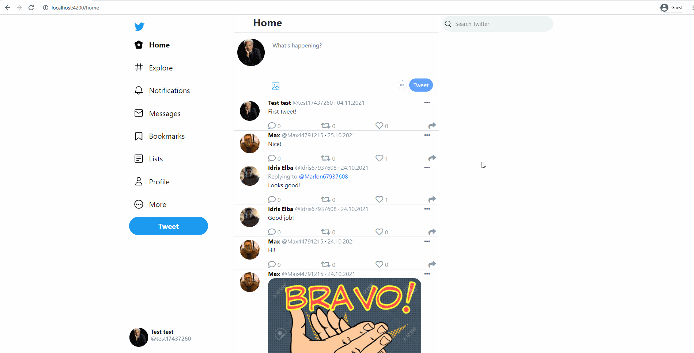
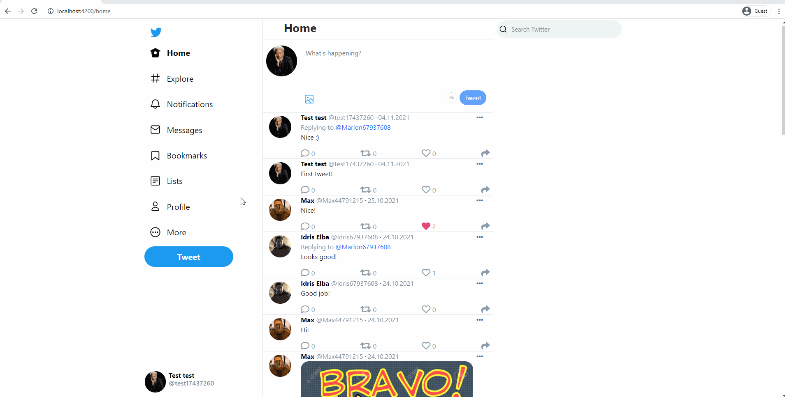

<div align="center">
<h1>Twitter Clone Project</h1>
 
</div>

## About The Project

<p>It is an ASP .NET Core & Angular project made to reinforce the .NET Core Developer training that I received. Here, the data is transferred to the UI layer by establishing a database communication with the WEB API in the ASP .NET Core framework. UI layer was created with the Angular framework. EF Core - Code First approach and JWT token authentication were used in the project. Currently, there are actions about user registration, user profiles, tweeting, deleting tweets, like, comment, follow, follow list. The project is under development.
</p>

### Built with

- Front-End:
  - [Angular](https://angular.io/) / [Visual Studio Code](https://code.visualstudio.com/)
  - [Typescript](https://www.typescriptlang.org/)
  - [Bootstrap](https://getbootstrap.com)
  - [Ng-bootstrap](https://ng-bootstrap.github.io/#/home)
- Back-End:
  - [ASP .NET Core](https://docs.microsoft.com/en-us/aspnet/core/?view=aspnetcore-5.0) / [Visual Studio 2019](https://visualstudio.microsoft.com/vs/)
  - [Entity Framework Core](https://docs.microsoft.com/en-us/ef/core/)
  - [JWT](https://jwt.io/)
  - [Fluent Validation](https://fluentvalidation.net/)
  - [AutoMapper](https://automapper.org/)
- Database & Cloud:
  - [Microsoft SQL Server](https://www.microsoft.com/en-us/sql-server/sql-server-downloads)
  - [Cloudinary](https://cloudinary.com/)

### Installing / Getting started

1. For angular you need to add node modules. Run this command in your terminal.

```
npm install --save-dev @angular-devkit/build-angular
```

2. For running the API, u have to add an user secret file or update ur appsettings.

- Adding user secret:


- Or update ur appsettings and remove user secret reference from TwitterAPI.csproj:

```
{
  "ConnectionStrings": {
    "ConStr": "YOUR_CONNECTION_STRING",
    "DbType": "YOUR_DB_TYPE"
  },
  "AppSettings": {
    "SecretKey": "YOUR_SECRET_KEY"
  },
  "CloudinarySettings": {
    "CloudName": "YOUR_CLOUDINARY_ACCOUNT_CLOUD_NAME",
    "ApiKey": "YOUR_CLOUDINARY_API_KEY",
    "ApiSecret": "YOUR_CLOUDINARY_API_SECRET_KEY"
  }
}
```

3. For Cloudinary you can create a free account to store your images. [To sign up for free.](https://cloudinary.com/users/register/free)

4. Database creation:
   - Open package manager console in Visual Studio.
   - Select 'TwitterDB' as default project in package manager console.
   - And then run this command: `update-database`

### Views / Actions

- ##### Sign up:

  
  </br>

- ##### Log in & First Tweet:

  
  </br>

- ##### Post & Delete:

  
  </br>

- ##### Search & Follow:

  
  </br>

- ##### Unfollow:

  
  </br>

- ##### Set Up Profile:

  
  </br>

- ##### Like & Reply:

  
  </br>

- ##### Follow List & Log Out:
  
  </br>
